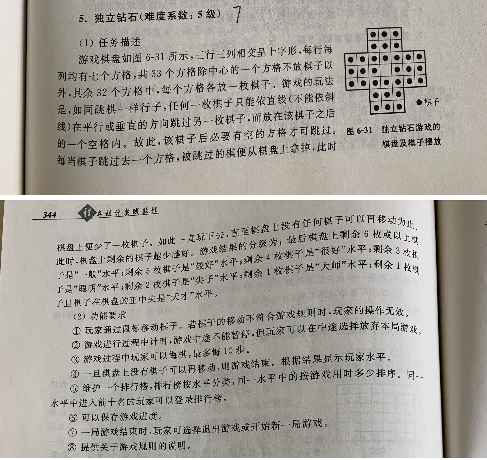

# 基于Gt的独立钻石游戏

很久没有写C代码了，接了一个大作业外包活，帮忙实现一个C语言小游戏。

非GUI方式很好完成，基本逻辑比较简单；这里要求有GUI，通过鼠标移动棋子。在学习了Qt的基本图形组件后，完成了整个游戏开发。

## 功能要求

- 移动棋子
- 计时
- 悔棋，最多悔10步
- 游戏结束及游戏水平判定
- 排行榜
- 保存游戏进度

## 功能实现

- 实现虚函数`paintEvent(QPaintEvent*)`,绘画棋盘，棋子  

  重写`mousePressEvent`, `mouseReleaseEvent`这两个方法实现鼠标相关操作

- 使用定时器`QTimer`作为信号，与槽函数`timeUpdate`绑定，更新计时标签。

- 基于循环队列实现悔棋棋局的记录，这种方式比较容易实现  

  可以优化为存储每一步的移动，悔棋的实现逻辑会稍微复杂一些

- 排行榜 ToDo

- C语言实现读写记录比较麻烦，使用`fread/fwrite`读写`diamond_game`整块内存

## 问题记录

- 分离前后端逻辑 三个文件无法编译 initGame  
  解决：  
  直接将后台代码整合到Qt的视图代码diamondboard.cpp中  

  **项目结构待优化**
  
- 悔棋有超过限定次数会出现棋局混乱  
  原因：循环队列存在负数取模，C语言结果与数学含义不一致  
  解决： + 取模值  
  ~~int lastIndex = (index - 1) % HISTORY_RECORD_NUM;~~  
  int lastIndex = (index - 1 + HISTORY_RECORD_NUM) % HISTORY_RECORD_NUM;

- 循环队列只能存 模数 - 1 个状态  
  将宏定义改为 #define HISTORY_RECORD_NUM 10+1，后发现 悔棋后棋盘会为空  
  由于宏定义替换为整体 10+1 影响了计算顺序  
  解决： 改为 11 或加括号 (10+1)  

  #define HISTORY_RECORD_NUM (10+1)
  
- 游戏计时处理了很久，QTimer、QTime、c_time类型都尝试了，在设计timeLabel更新上，都会存在重新载入计时错误问题  
  解决：  
  熟悉了QTime类型后，不再用其他方式实现，QTimer仅用作定时器，触发更新实时显示的时间标签  
